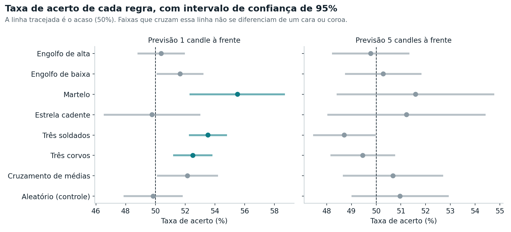
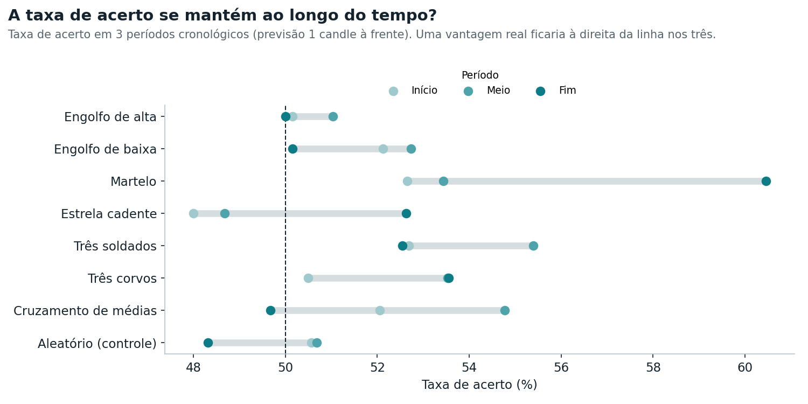
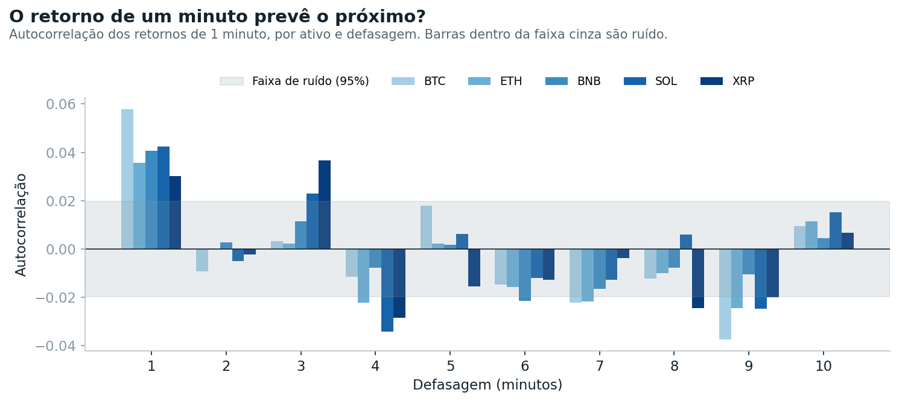

# 📈 Padrões de candles preveem o preço no curto prazo?

Estudo estatístico com **50.000 candles reais de 1 minuto** de 5 criptomoedas (BTC, ETH, BNB, SOL, XRP), coletados da API pública da Binance entre 24/09/2026 e 01/10/2026.


---

## 📌 A pergunta

Padrões de candles e cruzamentos de médias móveis são muito usados para tentar prever o próximo movimento do preço. **Essas regras acertam a direção do preço mais do que o acaso?**

## 🧭 Contexto

Este estudo nasceu de um projeto anterior: um painel em JavaScript que eu construí para detectar padrões de candles em tempo real, com dados da Binance. Ao adicionar backtest e validação estatística ao painel, os resultados indicaram que os padrões não tinham poder de previsão confiável. Este repositório refaz essa investigação em Python, de forma reprodutível e com mais rigor.

## 🔬 Metodologia

1. **Coleta:** 10.000 candles de 1 minuto por ativo, via API pública da Binance
2. **Regras testadas:** 6 padrões de candles (engolfo de alta e de baixa, martelo, estrela cadente, três soldados, três corvos), cruzamento de médias exponenciais 9/21 e um **grupo de controle aleatório**
3. **Backtest:** cada sinal é comparado com o preço 1 e 5 candles depois
4. **Intervalo de confiança de Wilson (95%)** para cada taxa de acerto
5. **Teste binomial com correção de Bonferroni**, porque testar 16 combinações ao mesmo tempo aumenta a chance de "achados" por sorte
6. **Validação walk-forward:** a taxa de acerto em 3 períodos cronológicos separados
7. **Brier score fora da amostra:** a "confiança" estimada na 1ª metade dos dados é avaliada na 2ª metade
8. **Autocorrelação dos retornos** de 1 minuto, para medir se o preço tem "memória"

## 📊 Resultados



| Regra | Horizonte (candles) | Sinais | Taxa de acerto | IC 95% (Wilson) | p-valor |
|---|:---:|---:|:---:|:---:|:---:|
| Engolfo de alta | 1 | 3.776 | 50,4% | 48,8% a 52,0% | 0,6370 |
| Engolfo de baixa | 1 | 3.890 | 51,7% | 50,1% a 53,2% | 0,0386 |
| Martelo | 1 | 913 | 55,5% | 52,3% a 58,7% | 0,0009 |
| Estrela cadente | 1 | 906 | 49,8% | 46,5% a 53,0% | 0,9206 |
| Três soldados | 1 | 5.872 | 53,5% | 52,3% a 54,8% | 0,0000 |
| Três corvos | 1 | 5.483 | 52,5% | 51,2% a 53,8% | 0,0002 |
| Cruzamento de médias | 1 | 2.264 | 52,2% | 50,1% a 54,2% | 0,0415 |
| Aleatório (controle) | 1 | 2.405 | 49,9% | 47,9% a 51,9% | 0,9026 |
| Engolfo de alta | 5 | 3.899 | 49,8% | 48,2% a 51,4% | 0,7978 |
| Engolfo de baixa | 5 | 3.991 | 50,3% | 48,7% a 51,8% | 0,7277 |
| Martelo | 5 | 940 | 51,6% | 48,4% a 54,8% | 0,3442 |
| Estrela cadente | 5 | 935 | 51,2% | 48,0% a 54,4% | 0,4719 |
| Três soldados | 5 | 6.011 | 48,7% | 47,4% a 50,0% | 0,0470 |
| Três corvos | 5 | 5.635 | 49,5% | 48,2% a 50,8% | 0,4241 |
| Cruzamento de médias | 5 | 2.342 | 50,7% | 48,7% a 52,7% | 0,5218 |
| Aleatório (controle) | 5 | 2.480 | 51,0% | 49,0% a 52,9% | 0,3453 |

Nível de significância após a correção de Bonferroni: **0,0031**.

### Estabilidade ao longo do tempo


Regras acima de 50% nos três períodos: Engolfo de baixa, Martelo, Três soldados, Três corvos.

### O preço tem memória?


18 de 50 coeficientes de autocorrelação ficaram fora da faixa de ruído. Há alguma dependência entre minutos consecutivos, que merece uma investigação mais aprofundada.

### A "confiança" das regras tem valor?
7 de 14 combinações tiveram Brier score fora da amostra melhor que 0,25 (o resultado de sempre dizer 50%). Ou seja: em pelo menos metade dos casos, a taxa de acerto histórica de uma regra não serviu como confiança útil para o futuro.

## ⚖️ Limitações

- **Período curto:** uma semana de dados. Um padrão que aparece em uma semana pode não se repetir em outras condições de mercado.
- **Ativos correlacionados:** as criptomoedas costumam se mover juntas, então os sinais dos 5 ativos não são totalmente independentes e os p-valores podem estar otimistas.
- **Grupo de controle:** o sorteio aleatório teve taxa de acerto de 49,9% (1 candle), 51,0% (5 candles), uma referência do quanto o acaso sozinho pode variar.

## ✅ Conclusão

**3 de 14 combinações** ficaram acima do acaso com significância estatística: Martelo (1 candle: 55,5%), Três soldados (1 candle: 53,5%), Três corvos (1 candle: 52,5%). A vantagem é pequena e **desaparece quando a previsão é de 5 candles**, o que sugere um efeito de curtíssimo prazo, de um minuto para o seguinte, e não um poder de previsão duradouro dos padrões. Uma diferença desse tamanho também precisaria ser comparada com os custos de operação (taxas e spread) antes de ter qualquer valor prático.

O principal aprendizado é metodológico: **uma taxa de acerto que parece boa no gráfico pode ser só ruído**. Intervalo de confiança, correção para múltiplos testes, validação fora da amostra e um grupo de controle aleatório são o que separa um padrão real de uma coincidência.

> ⚠️ Este é um estudo estatístico para fins educacionais. Não é recomendação de investimento.

## ▶️ Como reproduzir

```bash
git clone https://github.com/AlessandroMaxv10/estudo-padroes-candles.git
cd estudo-padroes-candles
pip install -r requirements.txt
jupyter notebook estudo.ipynb
```

Os dados são baixados automaticamente da API pública da Binance (sem cadastro). Ao final, o notebook gera os gráficos e este README com os números da execução.

## 🛠️ Tecnologias

- **Python**, **Pandas** e **NumPy** — coleta, tratamento e backtest
- **SciPy** — teste binomial
- **Matplotlib** — gráficos
- **API pública da Binance** — dados de mercado

## 📚 O que aprendi

- Coletar dados de uma API REST com paginação e limite de requisições
- Desenhar um backtest sem usar informação do futuro
- Aplicar intervalos de confiança, testes de hipótese e correção de Bonferroni
- Validar resultados fora da amostra (walk-forward e Brier score)
- Usar um grupo de controle para não se enganar com padrões aleatórios

---

👤 **Alessandro José dos Santos** · [LinkedIn](https://www.linkedin.com/in/alessandro-jos%C3%A9-dos-santos-01b87a127) · [Portfólio](https://alessandromaxv10.github.io)
